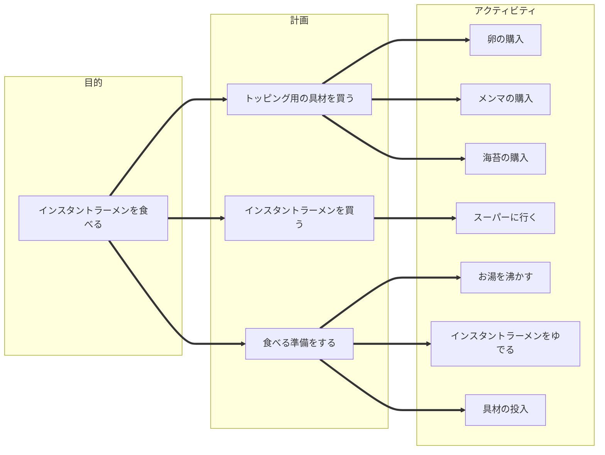

```mermaid
flowchart LR
    subgraph  目的
        id[インスタントラーメンを食べる]
    end
    subgraph  計画
        id1[トッピング用の具材を買う]
        id2[インスタントラーメンを買う]
        id3[食べる準備をする]
    end
    subgraph  アクティビティ
        id4[卵の購入]
        id5[メンマの購入]
        id6[海苔の購入]
        id7[スーパーに行く]
        id8[お湯を沸かす]
        id9[インスタントラーメンをゆでる]
        id10[具材の投入]
    end
    id==>id1
    id==>id2
    id==>id3
    id1==>id4
    id1==>id5
    id1==>id6
    id2==>id7
    id3==>id8
    id3==>id9
    id3==>id10

```