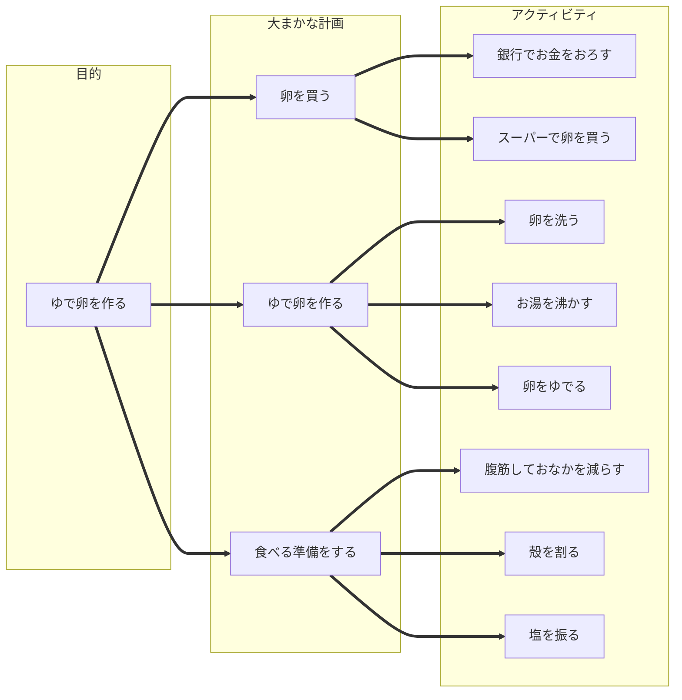

```mermaid
flowchart LR
  subgraph 目的
  id[ゆで卵を作る]
  end
  subgraph 大まかな計画
  id1[卵を買う]
  id2[ゆで卵を作る]
  id3[食べる準備をする]
  end
  subgraph アクティビティ
  id4[銀行でお金をおろす]
  id5[スーパーで卵を買う]
  id6[卵を洗う]
  id7[お湯を沸かす]
  id8[卵をゆでる]
  id9[腹筋しておなかを減らす]
  id10[殻を割る]
  id11[塩を振る]
  end
  id ==>id1
  id ==>id2
  id ==>id3
  id1 ==>id4
  id1 ==>id5
  id2 ==>id6
  id2 ==>id7
  id2 ==>id8
  id3 ==>id9
  id3 ==>id10
  id3 ==>id11

```